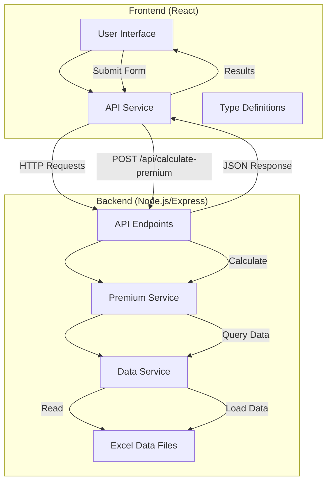
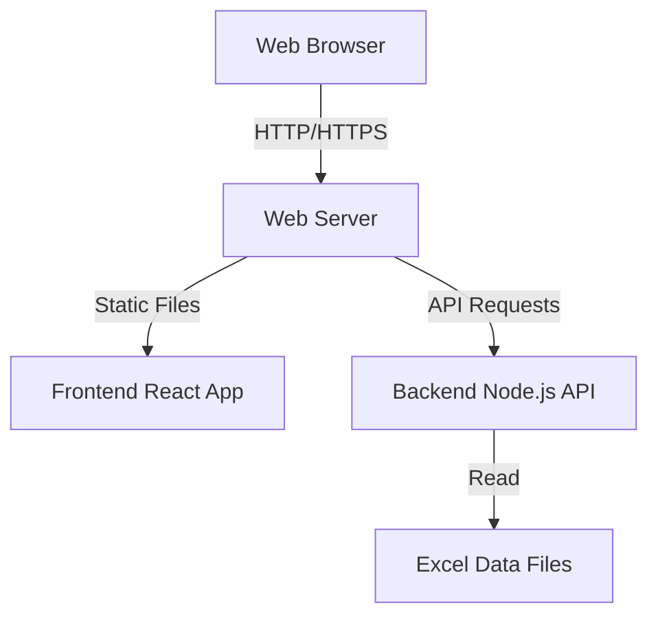

# Premium Calculator Application - Architecture Document

## Overview

The Premium Calculator is a web application that calculates health insurance premiums based on various factors such as product type, state, scale code, payment frequency, and more. The application consists of a React frontend and a Node.js/Express backend API, with Excel files used for data storage instead of a traditional database.

## System Architecture

The application follows a client-server architecture with a clear separation between the frontend and backend components:



## Component Details

### Frontend Components

1. **User Interface (PremiumCalculator.tsx)**
   - Provides form inputs for all premium calculation parameters
   - Handles form submission and displays calculation results
   - Implements responsive design using Tailwind CSS

2. **API Service (api.ts)**
   - Manages HTTP communication with the backend API
   - Uses Axios for making API requests
   - Handles error responses and logging

3. **Type Definitions (premium.ts)**
   - Defines TypeScript interfaces for request parameters and response data
   - Ensures type safety throughout the application

### Backend Components

1. **API Endpoints (server.js)**
   - Exposes RESTful API endpoints
   - Handles request validation
   - Routes requests to appropriate services
   - Provides Swagger documentation

2. **Premium Service (premiumService.js)**
   - Implements the core premium calculation logic
   - Processes calculation parameters
   - Applies business rules for premium adjustments

3. **Data Service (dataService.js)**
   - Loads Excel data into memory
   - Provides query functions to retrieve data
   - Acts as a data access layer

4. **Excel Data Files**
   - ProductRateMaster.xlsx: Contains base rates and product information
   - ProductRateDetail.xlsx: Contains detailed rates for different payment frequencies
   - ScaleFactors.xlsx: Contains scaling factors for different coverage types
   - RiskLoading.xlsx: Contains risk loading percentages based on age and gender
   - RebatePercentage.xlsx: Contains rebate percentages for different types

## Data Flow

### Premium Calculation Process

1. **User Input**
   - User fills out the premium calculation form in the frontend
   - Form includes product codes, state, scale code, payment frequency, etc.

2. **API Request**
   - Frontend sends a POST request to `/api/calculate-premium` endpoint
   - Request body contains all parameters needed for calculation

3. **Backend Processing**
   - API validates the request parameters
   - PremiumService calculates premiums for each product code
   - DataService retrieves necessary data from Excel files

4. **Calculation Steps**
   - Get base premium from ProductRateMaster
   - Apply scale factor if using base rate calculation
   - Apply payment frequency adjustments
   - Add risk loading amounts if applicable
   - Apply LHC loading if applicable
   - Apply rebate if applicable

5. **Response**
   - Backend returns calculation results as JSON
   - Frontend displays the results to the user

## API Endpoints

### 1. Calculate Premium

```
POST /api/calculate-premium
```

**Request Body:**
```json
{
  "effectiveDate": "2025-06-01",
  "productCodes": ["H0A", "HA0"],
  "stateCode": "A",
  "scaleCode": "S",
  "rateCode": "0",
  "paymentFrequency": "monthly",
  "rebateType": "RB",
  "lhcPercentage": 0,
  "useBaseRate": true,
  "useRiskRating": false
}
```

**Response:**
```json
{
  "results": [
    {
      "productCode": "H0A",
      "basePremium": 286.80,
      "scaledBasePremium": 286.80,
      "scaleAndFrequencyPremium": 286.80,
      "finalPremium": 258.12,
      "scaleFactor": 1.0,
      "riskLoading1": null,
      "riskLoading2": null,
      "riskLoadingAmount1": null,
      "riskLoadingAmount2": null,
      "rebatePercentage": 10.0,
      "rebateAmount": 28.68,
      "premiumBeforeRebate": 286.80,
      "lhcPercentage": 0,
      "lhcAmount": 0.00
    },
    {
      "productCode": "HA0",
      "basePremium": 82.35,
      "scaledBasePremium": 82.35,
      "scaleAndFrequencyPremium": 82.35,
      "finalPremium": 74.12,
      "scaleFactor": 1.0,
      "riskLoading1": null,
      "riskLoading2": null,
      "riskLoadingAmount1": null,
      "riskLoadingAmount2": null,
      "rebatePercentage": 10.0,
      "rebateAmount": 8.24,
      "premiumBeforeRebate": 82.35,
      "lhcPercentage": 0,
      "lhcAmount": 0.00
    }
  ],
  "totalPremium": 332.24
}
```

### 2. Generate Sample Data

```
GET /api/generate-sample-data
```

**Response:**
```json
{
  "message": "Sample data generated successfully"
}
```

### 3. Debug Product Lookup

```
GET /api/debug-product/{productCode}
```

**Response:**
```json
{
  "success": true,
  "message": "Product found",
  "product": {
    "ProductCode": "H0A",
    "StateCode": "A",
    "RateCode": 0,
    "BaseRate": 286.80,
    "LHCApplicable": "Y",
    "RebateApplicable": "Y",
    "DateOn": "2023-01-01",
    "DateOff": "2099-12-31"
  }
}
```

## Technical Implementation Details

### Frontend Implementation

- Built with React and TypeScript
- Uses Tailwind CSS for styling
- Form validation and state management with React hooks
- API communication using Axios

### Backend Implementation

- Built with Node.js and Express
- Uses XLSX library for Excel file operations
- In-memory data store for Excel data
- RESTful API design
- Swagger documentation

### Data Storage

The application uses Excel files instead of a traditional database:

1. **Data Loading Process**
   - Excel files are loaded into memory on server startup
   - Data is parsed and converted to JavaScript objects
   - In-memory data store provides query functions

2. **Data Query Process**
   - Query functions filter in-memory data based on parameters
   - Date ranges are checked for effective dates
   - Results are returned to the premium service for calculations

## Deployment Architecture

The application can be deployed as follows:



## Security Considerations

1. **Input Validation**
   - All API endpoints validate input parameters
   - Frontend implements form validation

2. **Error Handling**
   - Backend provides appropriate error responses
   - Frontend displays error messages to users

3. **Data Protection**
   - Excel files should be properly secured in production
   - Consider encryption for sensitive data

## Future Enhancements

1. **Database Migration**
   - Replace Excel files with a proper database for better performance and security
   - Implement database migrations for schema changes

2. **Authentication and Authorization**
   - Add user authentication for secure access
   - Implement role-based access control

3. **Caching**
   - Implement caching for frequently accessed data
   - Reduce calculation time for repeated requests

4. **Logging and Monitoring**
   - Add comprehensive logging
   - Implement monitoring for system health

5. **Containerization**
   - Package the application as Docker containers
   - Simplify deployment and scaling

## Conclusion

The Premium Calculator application follows a clean architecture with separation of concerns between frontend and backend components. The use of Excel files for data storage provides a simple solution for this specific use case, though a database migration would be recommended for a production environment with higher load or security requirements.